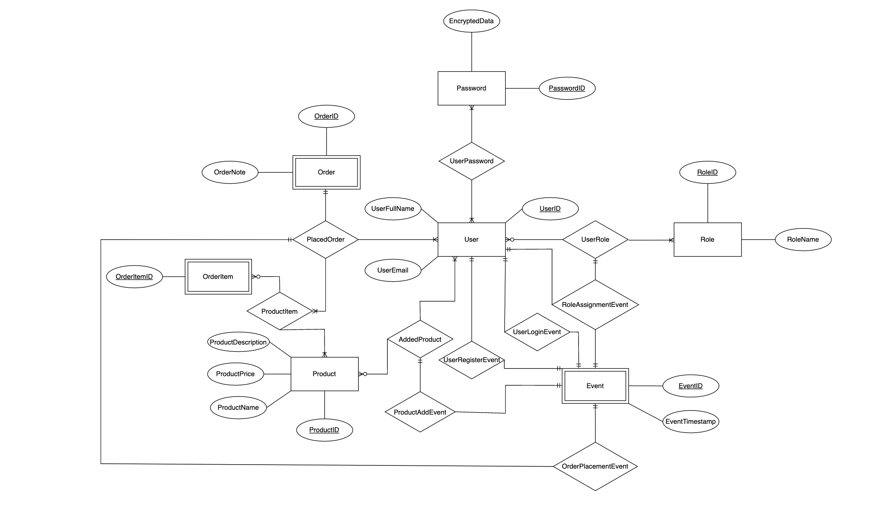

### Some Important Notes For Developers

# Introduction

This API has been developed for Ekinoks Golang Coding Challenge.  
Endpoints:  
\- Add customer (new customer adding by admin).  
\- Add product.  
\- Update product.  
\- Make an order.  
\- List customer orders with details.  
\- Login/Register/Logout.

# To Run With Docker

To run through Docker Compose, run `docker-compose up` command in the project's root directory.


# Overview

PLEASE NOTE THAT: The api has only tested for the endpoints that specified in the Introduction section and the DB operations for those. The service has many methods and unit tests for database operations but there are not tested well, due to the deadline.

# Database ER Diagram
The database has designed with an ER diagram:


# Why The API Has Not Running Properly?

This API was originally planned to be developed with a microservice architecture. However, due to some design and integration difficulties brought by the microservice architecture, this API started to be developed as a single piece after a period of time. This resulted in the loss of about half of the time.

I continued to develop until the deadline, thinking that the coding style, database design, model class design, request and response structures, and the design pattern of the software would be taken into account along with the functionality.

# Examples
An example for product info:

JSON body of the request:
```
{
	"product_id": 1
}
```
The response:
```
{
	"product": {
			"productID": 1,
			"productName": "Dummy Product 1",
			"productPrice": 10.99,
			"productDescription": "This is the first dummy product."
		},
		"success": true,
		"message": ""
}	
```

An example for user addition:

JSON body of the request:
```
{
	"user": {
		"userFullName": "Dummy user",
		"userEmail": "example@mail.com"
	},
	"role": {
		"roleName": "Customer"
	}
}
```
The response:
```
{
    "user_id": 7,
    "user_full_name": "Dummy user",
    "user_email": "example@mail.com",
    "user_role": "Customer",
    "success": false,
    "message": ""
}
```
(An error causing during the process, than results success: false)

# Requests & Responses

This section shows the structures of requests and responses.

REQUESTS

```
type RequestUserInfo struct {
	UserID int `json:"user_id"`
}

type RequestProductInfo struct {
	ProductID int `json:"product_id"`
}

type RequestRoleInfo struct {
	RoleID int `json:"role_id"`
}

// If UserID has specified, than OrderID is ignored
type RequestOrderInfo struct {
	OrderID int `json:"order_id"`
	UserID  int `json:"user_id"`
}

// If UserID has specified, than UserRoleID is ignored
type RequestRoleAssignmentEventInfo struct {
	UserRoleID int `json:"user_role_id"`
	UserID     int `json:"user_id"`
}

type RequestUserLoginEventInfo struct {
	UserID int `json:"user_id"`
}

// If UserID has specified, than PlacedOrderID is ignored
type RequestOrderPlacementEventInfo struct {
	PlacedOrderID int `json:"placed_order_id"`
	UserID        int `json:"user_id"`
}

// If UserID has specified, than ProductID is ignored
type RequestProductAddEventInfo struct {
	ProductID int `json:"product_id"`
	UserID    int `json:"user_id"`
}

type RequestAddUser struct {
	User User `json:"user"`
	Role Role `json:"role"`
}

type RequestAddProduct struct {
	Product Product `json:"product"`
}

type RequestUpdateProduct struct {
	Product Product `json:"product"`
}

type RequestPlaceOrder struct {
	Order  Order         `json:"order"`
	Items  []ProductItem `json:"items"`
	UserID int           `json:"user_id"`
}

type RequestAssignRole struct {
	UserID int `json:"user_id"`
	RoleID int `json:"role_id"`
}

type RequestUserLogin struct {
	UserEmail string `json:"user_email"`
	Password  string `json:"password"`
}

type RequestUserRegister struct {
	User                 User   `json:"user"`
	Password             string `json:"password"`
	PasswordVerification string `json:"password_verification"`
}
```

RESPONSES

```

type ResponseBase struct {
	Success bool   `json:"success"`
	Message string `json:"message"`
}

type ResponseUserInfo struct {
	UserID       int    `json:"user_id"`
	UserFullName string `json:"user_full_name"`
	UserEmail    string `json:"user_email"`
	UserRole     string `json:"user_role"`
	ResponseBase
}

type ResponseProductInfo struct {
	Product Product `json:"product"`
	ResponseBase
}

type PlacedOrderInfo struct {
	OrderID   int    `json:"order_id"`
	OrderNote string `json:"order_note"`
	Items     []Item `json:"items"`
}

type Item struct {
	ProductItemID       int                 `json:"product_item_id"`
	ProductItemQuantity int                 `json:"product_item_quantity"`
	ProductItemPrice    float64             `json:"product_item_price"`
	ProductInfo         ResponseProductInfo `json:"product_info"`
}

type ResponseOrderInfo struct {
	Actor            ResponseUserInfo  `json:"actor"`
	PlacedOrdersInfo []PlacedOrderInfo `json:"placed_orders_info"`
	ResponseBase
}

type ResponseRoleAssignmentEventInfo struct {
	Timestamp    string           `json:"timestamp"`
	Actor        ResponseUserInfo `json:"actor"`
	AssignedUser ResponseUserInfo `json:"assigned_user"`
	ResponseBase
}

type ResponseUserLoginEventInfo struct {
	Timestamp string           `json:"timestamp"`
	Actor     ResponseUserInfo `json:"actor"`
	ResponseBase
}

type ResponseUserRegisterEventInfo struct {
	Timestamp string           `json:"timestamp"`
	Actor     ResponseUserInfo `json:"actor"`
	ResponseBase
}

type ResponseOrderPlacementEventInfo struct {
	Timestamp string            `json:"timestamp"`
	Order     ResponseOrderInfo `json:"order"`
	ResponseBase 
}

type ResponseProductAddEventInfo struct {
	Timestamp string              `json:"timestamp"`
	Actor     ResponseUserInfo    `json:"actor"`
	Product   ResponseProductInfo `json:"product"`
	ResponseBase
}

type ResponseEventsInfo struct {
	RoleAssignmentEvents []ResponseRoleAssignmentEventInfo `json:"role_assignment_events,omitempty"`
	UserLoginEvents      []ResponseUserLoginEventInfo      `json:"user_login_events,omitempty"`
	UserRegisterEvents   []ResponseUserRegisterEventInfo   `json:"user_register_events,omitempty"`
	OrderPlacementEvents []ResponseOrderPlacementEventInfo `json:"order_placement_events,omitempty"`
	ProductAddEvents     []ResponseProductAddEventInfo     `json:"product_add_events,omitempty"`
	ResponseBase
}
```